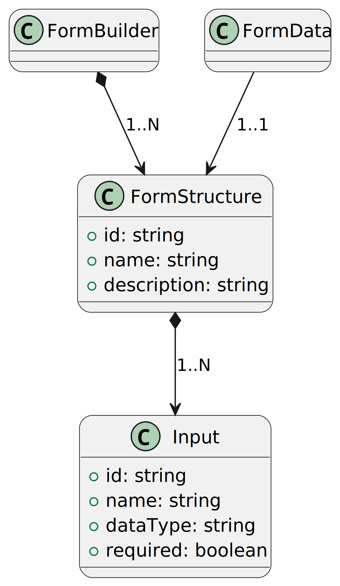

= Form Builder
:toc:
:toc-title: Contents

== Introduction
Form builder is a web application that allows creating forms for different purposes.

== Domain model

== Use cases and actors

[cols="1,1,1", options="header"]
|===
| Form Structure | Form Data | Input

a|image::./images/1-requeriments/1-actors-use-cases/user/form-structure.svg[]
a|image::./images/1-requeriments/1-actors-use-cases/user/form-data.svg[]
a|image::./images/1-requeriments/1-actors-use-cases/user/input.svg[]
|===

=== Use Case Context

== Use cases specifications

[cols="1,1", options="header"]
|===
| Form Structure Management | Form Data Management

a|image::./images/1-requeriments/2-use-cases-specifications/user/form-structure-management.svg[]
a|image::./images/1-requeriments/2-use-cases-specifications/user/form-data-management.svg[]

| Input Management |

a|image::./images/1-requeriments/2-use-cases-specifications/user/input-management.svg[]
|
|===

